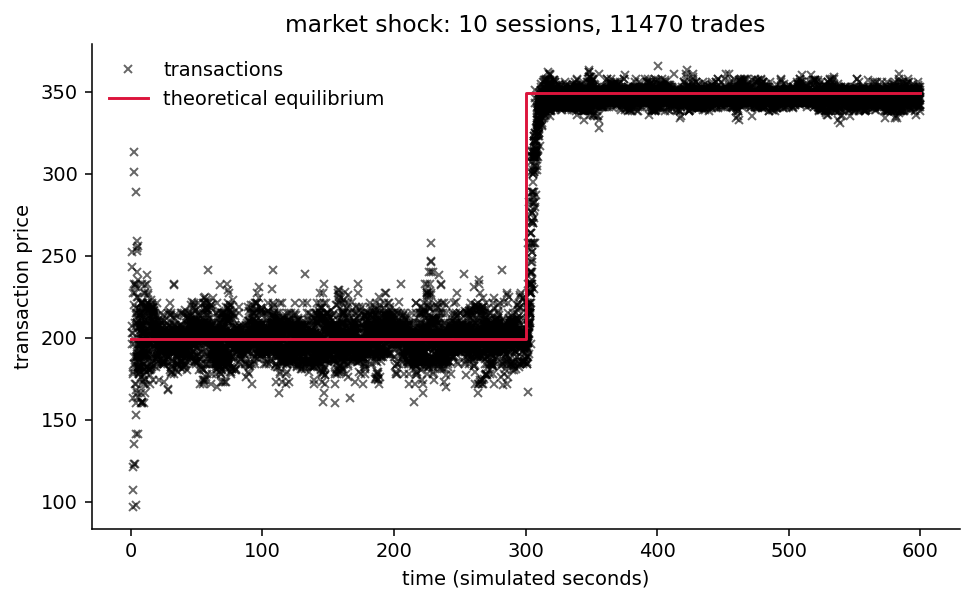

<h1 align="center">Internet Economics and Financial Technology</h1>

<p align="center"><strong>Experimental market simulation, hypothesis testing, and sentiment analysis for trading</strong></p>

Three strands of coursework from the University of Bristol, written as four
Jupyter notebooks and since rebuilt as a tested package.

The first replicates the experiment Vernon Smith reported in his 1962 paper, in
which human traders in a sealed market converge on the competitive equilibrium
price without ever being told what it is, using the Bristol Stock Exchange
simulator and populations of algorithmic traders. The second is hypothesis
testing over two small experimental datasets. The third asks whether a
general-purpose sentiment analyser can be trusted to drive a trading signal.

The rebuild changed some of the answers, and made two of the notebooks run at
all.

## What is here

- A wrapper over the Bristol Stock Exchange that runs market sessions in a
  temporary directory, takes an explicit seed, and returns parsed results, with
  supply and demand schedules expressed as data.
- Smith's coefficient of convergence, computed per trading period against the
  equilibrium in force during that period, so a market shock is measured rather
  than eyeballed.
- An assumption-aware hypothesis testing pipeline that tests for normality and
  equal variance and then chooses the appropriate omnibus test, rather than
  running ANOVA whatever the answer.
- Document, sentence and aspect level sentiment analysis, with the aspect
  splitting index arithmetic corrected.
- A command line interface, and 165 tests.

## Results

[FINDINGS.md](FINDINGS.md) records what each strand measures, with the seed and
repeat count beside every number.

The three headlines:

**Smith's finding replicates, and the market shock shows it best.** When the
equilibrium jumps from 199.5 to 349.5 half way through a session, convergence
degrades for exactly one trading period and then settles tighter than it ever
was on the original price. The population re-converges on a number nobody told
it.

**One dataset was analysed with a test its own normality check had ruled out.**
Both conditions of the second dataset reject Shapiro-Wilk, and the notebook ran
one-way ANOVA regardless, because nothing branched on the result. The conclusion
survives under Kruskal-Wallis, but it was not justified.

**A general-purpose sentiment analyser is useless for trading, in two different
ways.** The Associated Press hack tweet of April 2013, which moved US indices by
about one percent in three minutes, scores polarity 0.0000 and subjectivity
0.0000: TextBlob scores none of its words at all. The Muddy Waters short-selling
announcement of August 2019 scores mildly *positive* the evening before its
target lost more than half its value.



## Install

```bash
git clone https://github.com/ReverseZoom2151/internet-economics-and-fintech.git
cd internet-economics-and-fintech

python -m venv venv
source venv/bin/activate        # Windows: venv\Scripts\activate

pip install -r requirements-dev.txt
```

Python 3.10 or later.

The sentiment analysis needs an NLTK tokenizer, which is downloaded on demand:

```bash
python -m experiments.week7_sentiment --download
```

## Usage

```bash
# The Vernon Smith market experiments
python -m fintech market baseline
python -m fintech market shock --sessions 10 --seed 100
python -m fintech market all --save-figures figures

# Hypothesis testing, with the chosen test named and justified
python -m fintech datasets
python -m fintech stats data2

# Sentiment, on the corpus or on your own text
python -m fintech sentiment hack_crash_tweet
python -m fintech sentiment "This laptop is wonderful but the battery is poor."
```

The three experiment modules reproduce everything in FINDINGS.md:

```bash
python -m experiments.smith1962
python -m experiments.week5_hypothesis
python -m experiments.week7_sentiment
```

Every market command takes a `--seed`. Nothing is written to disk unless
`--save-figures` names a directory.

## Layout

```text
fintech/
  vendor/BSE.py     the Bristol Stock Exchange, vendored unmodified, MIT
  vendor/NOTICE.md  attribution, and the upstream API change this project handles
  schedules.py      supply and demand schedules, and trader populations, as data
  market.py         session wrapper: temporary directory, explicit seed, parsed tape
  smith.py          Smith's coefficient of convergence, and the named experiments
  datasets.py       the course datasets, loaded by name and validated
  hypothesis_tests.py  normality, equal variance, the chosen omnibus test, post-hoc
  sentiment.py      document, sentence and aspect level analysis
  reviews.py        the corpus, in clean UTF-8, with provenance
  plotting.py       figures, and filenames that survive a colon on NTFS
  cli.py            the command line interface
experiments/
  smith1962.py        the market replication
  week5_hypothesis.py both datasets through one pipeline
  week7_sentiment.py  the four texts, including the two tweets
data/               the course datasets
figures/            regenerated by the experiment modules
tests/              165 tests
FINDINGS.md         what each strand measures
```

## Tests

```bash
python -m pytest
```

The suite is headless, and it does not touch the network: the one test that
needs a corpus download is marked and deselected by default.

Two guards run on every test. Matplotlib is forced to a non-interactive backend
before anything imports it. And because the market simulator writes its session
data as CSV into the current working directory unconditionally, any test that
leaves such a file behind fails and is named, which is what proves the wrapper
really does run sessions somewhere temporary.

## On the vendored simulator

`fintech/vendor/BSE.py` is not part of this project. It is the Bristol Stock
Exchange, copyright 2012-2024 Dave Cliff, MIT licensed, vendored verbatim and
never modified here. See [the notice](fintech/vendor/NOTICE.md) for why it is
vendored rather than installed, and for the API change between the version the
original notebook was written against and the one this project targets. A test
asserts the file still matches its recorded checksum.

## Notes for anyone reading the history

This started as four notebooks, of which 68% to 94% of each file by size was
stored cell output. Rebuilding them turned up defects worth knowing about, all
recorded in the commit history and in [FINDINGS.md](FINDINGS.md):

- The market notebook could not run. It called `market_session` with eight
  arguments where current BSE takes seven, and `BSE.py` was not in the
  repository at all.
- Two of the four notebooks were 24 of 27 cells byte-identical, differing only
  in which `read_csv` line was commented out.
- The statistics ran a parametric test after their own preceding cell had
  rejected its normality assumption, because nothing branched on the result.
- The market notebook read cancellation records as transaction prices, and its
  equilibrium was not the round number it assumed.
- The aspect splitting mixed word indices with n-gram indices, so every plot
  label named a word the point did not cover.
- The sentiment corpus had been through a bad encoding round trip, leaving
  replacement characters where pound signs and apostrophes belonged.

## Licence and reading

Released under the [MIT Licence](LICENSE). The vendored simulator carries its
own, reproduced in its header.

- Smith, V. L. (1962). An experimental study of competitive market behavior.
  *Journal of Political Economy*, 70(2), 111-137.
- Cliff, D. *BSE: The Bristol Stock Exchange*.
  <https://github.com/davecliff/BristolStockExchange>

With thanks to the University of Bristol teaching team, whose notebooks this
began from.
